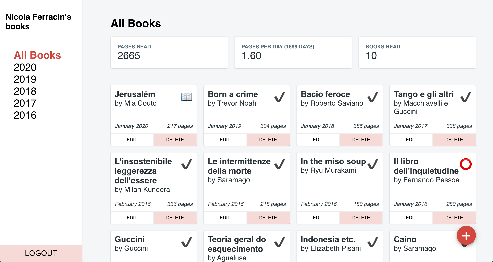

## Books Read



Firebase and React project to keep track of books read, with basic stats.

## How to use

The project is configured to run on Firebase (hosting, database and authentication), with Google Auth Provider.

1. Clone project with `git clone https://github.com/NicolaFerracin/books-read.git`

2. Install dependencies with `yarn`

3. [Create Firebase project](https://console.firebase.google.com/u/0/)

4. Select "Add Firebase to your web app"

5. Put Firebase config into `.env` file

```
REACT_APP_FIREBASE_API_KEY=apiKey
REACT_APP_FIREBASE_AUTH_DOMAIN=authDomain
REACT_APP_FIREBASE_DATABASE_URL=databaseURL
REACT_APP_FIREBASE_PROJECT_ID=projectId
REACT_APP_FIREBASE_STORAGE_BUCKET=storageBucket
REACT_APP_FIREBASE_MESSAGING_SENDER_ID=messagingSenderId
REACT_APP_FIREBASE_APP_ID=appId
```

6. Enable Google identity provider on the Firebase console, in the Authentication section

7. Create Database on Firebase console. The main collection must be called `books`

8. (Optional) Test app locally by running `yarn start`

9. Build the app with `yarn build`

10. Set up Firebase Hosting on the Firebase console and follow instructions

11. Init Firebase with `firebase init` (make sure to set `build` as the public directory and to not override `index.html`)

12. Deploy app to Firebase with `firebase deploy`

## Secure the app

Firebase has a free tier and to avoid going over the limit I suggest you limit access to your database.

1. After creating your account, find your user id (either in the browser console or in the Authentication section on the Firebase console)
2. Go to the Database section on your Firebase console
3. Go to Rules and paste the following

```
rules_version = '2';
service cloud.firestore {
  match /databases/{database}/documents {
    match /{document=**} {
      allow read: if request.auth.uid == resource.data.uid;
      allow write: if request.auth.uid == '<your-user-id>';
    }
  }
}
```

With this:

- reading resources is allowed only to the owner of the resources
- writing is allowed only to specific user id(s)
